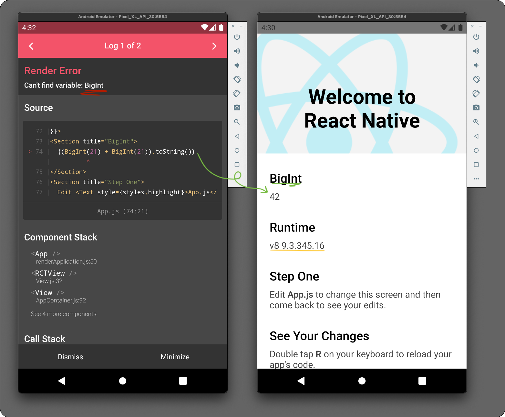

## `bigint` support for RN

this repo shows the changes necessary to add [v8 runtime](https://github.com/Kudo/react-native-v8/tree/0178b1753459b2799f3c0e93b581225d1a9128de) (and thus `bigint` support) to RN.

changes ([diff](https://github.com/janniks/RNStacks/compare/0909847..7a01e50)):

- we start from a default project initialized with `npx react-native init`
- we follow the steps in [`Installation for React Native >= 0.66`](https://github.com/Kudo/react-native-v8/blob/0178b1753459b2799f3c0e93b581225d1a9128de/README.md#installation-for-react-native--066)
- we change the babel preset to [`babel-preset-expo`](https://www.npmjs.com/package/babel-preset-expo/v/9.1.0)

_left: using `BigInt` with default runtime (RN 68.2); right: using `BigInt` with v8 runtime_
